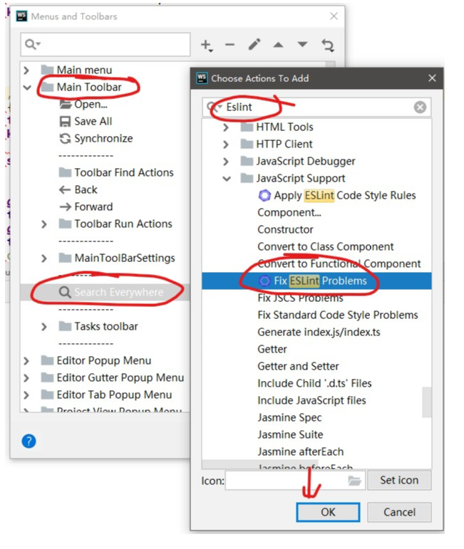

# WebStorm EsLint插件使用

## 必需
1. package.json配置了eslint依赖

## 使用方法
1. 正常使用方法：
    1. 在需要格式化的文件上右键选择'Fix ESLint Problems'
    
1. 工具栏快捷按钮：
    1. View-> Toolbar 确认已选中。
    1. 在工具栏上右键选择'Customize Menu and Toolbar'
    1. 如下图进行操作；
    
    1. 在需要格式化的文件上点击工具栏中出现的按钮
    
1. IDE快捷方式：
    1. File->Settings->Keymap
    1. 如图搜索eslint
    [img](./开发攻略/7.png)
    1. 在上图的'Fix ESLint Problems'上右键选择'Add Keyboard Shortcuts',然后会弹出一个对话框，此时只需要在键盘上按住你想设置的快捷键，IDE会自动识别并将其显示在输入框中，无需自行输入，确认无误后点击OK。此时会检查是否已存在相同的热键，若已存在相同的热键，请自行确认是否要覆盖。
    1. 打开文件，使用刚才设置的热键进行格式化。
