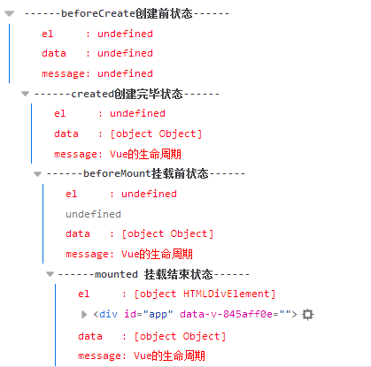
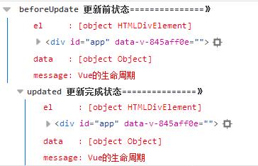
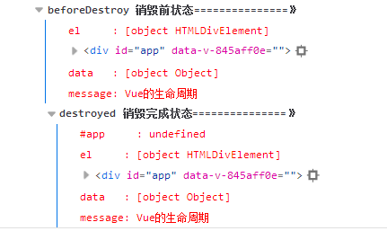

# 基础知识

## 工程化管理

目前来说，Web业务日益复杂化和多元化，现在随便找个前端项目，都已经不是过去的拼个页面+搞几个jQuery插件就能完成的了。工程复杂了就会产生许多问题，比如：如何进行高效的多人协作？如何保证项目的可维护性？如何提高项目的开发质量？那么我们就需要使用前端工程化解决上述问题.

### 前端工程化包括:

 - 模块化:将一个大文件拆分成相互依赖的小文件，再进行统一的拼装和加载。只有这样，才有多人协作的可能。
 - js模块化:比如es6的模块系统
 - css模块化:杜绝css的全局污染(比如vue 的scoped 属性)
 - 资源模块化:(依赖关系单一化,资源处理集成化,项目结构清晰化)使用webpack可实现这样的资源加载以及管理
 - 组件化:组件化不等于模块化,模块化是在文件层面,组件化是在代码层面,对UI的功能提炼和拆分=>提炼出组件库比如elementUI
 - 规范化:
	1. 目录结构的制定
	1. 编码规范
	1. 前后端接口规范
	1. 文档规范
	1. 组件管理
	1. Git分支管理
	1. Commit描述规范
	1. 定期CodeReview
	1. 视觉图标规范
	2. .....
   其中对于编码规范可以使用eslint强制规范,前后端接口管理可以使用同一接口管理工具比如postman等,我们这里使用的是doclever.


### 模块加载打包

 有了模块化的需求,那么模块打包,代码压缩,按需加载等问题也需要解决,现在有很多工具可以解决打包问题,比如webpack.


## 基本开发工具/环境介绍

### nodejs/npm

Node.js 是一个基于 Chrome V8 引擎的 JavaScript 运行环境。 Node.js 使用了一个事件驱动、非阻塞式 I/O 的模型，使其轻量又高效。 Node.js 的包管理器 npm，是全球最大的开源库生态系统。

### webpack

Webpack 是当下最热门的前端资源模块化管理和打包工具。它可以将许多松散的模块按照依赖和规则打包成符合生产环境部署的前端资源。还可以将按需加载的模块进行代码分隔，等到实际需要的时候再异步加载。通过 loader 的转换，任何形式的资源都可以视作模块，比如 CommonJs 模块、 AMD 模块、 ES6 模块、CSS、图片、 JSON、Coffeescript、 LESS 等。

## 基础技术介绍

我们这里主要介绍下框架现在主要用的技术vue 以及es6,关于css预处理语言可以自己去了解下

### vue基础介绍

[vue官网](https://cn.vuejs.org/v2/guide/ "vue官网")
[vue入门](http://www.hubwiz.com/course/566e67417e7d40946afc5ddc/ "vue入门")

#### 概念

> Vue.js是一套用于构建用户界面的渐进式框架。
> Vue.js的目标是通过尽可能简单的API实现响应的数据绑定和组合的视图组件。
> Vue.js的核心是一个响应的数据绑定系统，它让数据与DOM保持同步非常简单。
> 总的来说 Vue.js是一款轻量级的以数据驱动的前端JS框架，其和jQuery最大的不同点在于jQuery通过操作DOM来改变页面的显示，而Vue通过操作数据来实现页面的更新与展示。
#### vue实例

每个 Vue 应用都是通过用 Vue 函数创建一个新的 Vue 实例开始的：
```
var vm = new Vue({
  el:'#demo',
  data(){
    return{
       a:1,
       b:2
     }
    },
  created(){
   console.log(this);
  }
})
```
上面我们通过new Vue()构建了一个Vue的实例，在实例中，可以包含挂在元素（el），数据（data），模板（template），方法（methods）与生命周期钩子（created等）等选项。不同的实例选项拥有不同的功能，如：
（1）el表明我们的Vue需要操作哪一个元素下的区域，'#demo'表示操作id为demo的元素下区域。
（2）data表示Vue 实例的数据对象，data 的属性能够响应数据的变化。
（3）created表示实例生命周期中创建完成的那一步，当实例已经创建完成之后将调用其方法。

#### 单文件组件

在很多 Vue 项目中，我们使用 Vue.component 来定义全局组件，紧接着用 new Vue({ el: '#container '}) 在每个页面内指定一个容器元素。

这种方式在很多中小规模的项目中运作的很好，在这些项目里 JavaScript 只被用来加强特定的视图。但当在更复杂的项目中，或者你的前端完全由 JavaScript 驱动的时候，下面这些缺点将变得非常明显：

- 全局定义 (Global definitions) 强制要求每个 component 中的命名不得重复
- 字符串模板 (String templates) 缺乏语法高亮，在 HTML 有多行的时候，需要用到丑陋的 \
- 不支持 CSS (No CSS support) 意味着当 HTML 和 JavaScript 组件化时，CSS 明显被遗漏
- 没有构建步骤 (No build step) 限制只能使用 HTML 和 ES5 JavaScript, 而不能使用预处理器，如 Pug (formerly Jade) 和 Babel
所以vue提供文件扩展名为 .vue 的 single-file components(单文件组件) 为以上所有问题提供了解决方法，并且还可以使用 webpack  等构建工具。

```
<template>
<!-- 页面的内容 -->
</template>]
<script>
/* 页面的js */
</script>
<style scoped>
/* 页面的样式
注意:scoped的作用是style中所有的样式只对本页的html起作用
*/
</style>
```

这样的优点:

- 完整语法高亮
- CommonJS 模块
- 组件作用域的 CSS

#### 生命周期

vue生命周期的钩子函数,先上一个示例这里是一个vue实例:

```
<template>
  <div id="app" ref="app">
    <h1>{{message+num}}</h1>
    <button @click="destroyApp">destroyApp</button>
    <button @click="changeValue">changeValue</button>
  </div>
</template>


<script>
  export default {
    data() {
      return {
        message: 'Vue的生命周期',
        num:0
      }
    },
    beforeCreate() {
      //此时 data和dom节点都没有被创建
      console.group('------beforeCreate创建前状态------');
      console.log("%c%s", "color:red", "el     : " + this.$el); //undefined
      console.log("%c%s", "color:red", "data   : " + this.$data); //undefined
      console.log("%c%s", "color:red", "message: " + this.message)
    },
    created() {
      //此时data已经被初始化,但是dom还没有被创建
      console.group('------created创建完毕状态------');
      console.log("%c%s", "color:red", "el     : " + this.$el); //undefined
      console.log("%c%s", "color:red", "data   : " + this.$data); //已被初始化
      console.log("%c%s", "color:red", "message: " + this.message); //已被初始化
    },
    beforeMount() {
      //此时 data已经被初始化 虚拟dom节点已经被创建,但是还没有挂载到真实节点上,此时页面中没有显示
      console.group('------beforeMount挂载前状态------');
      console.log("%c%s", "color:red", "el     : " + (this.$el)); //已被初始化
      console.log(this.$el);
      console.log("%c%s", "color:red", "data   : " + this.$data); //已被初始化
      console.log("%c%s", "color:red", "message: " + this.message); //已被初始化
    },
    mounted() {
      //此时data已经被初始化 虚拟dom节点已经被挂载到页面上,页面显示
      console.group('------mounted 挂载结束状态------');
      console.log("%c%s", "color:red", "el     : " + this.$el); //已被初始化
      console.log(this.$el);
      console.log("%c%s", "color:red", "data   : " + this.$data); //已被初始化
      console.log("%c%s", "color:red", "message: " + this.message); //已被初始化
    },
    beforeUpdate() {
      //页面组件状态更新之前触发
      console.group('beforeUpdate 更新前状态===============》');
      console.log("%c%s", "color:red", "el     : " + this.$el);
      console.log(this.$el);
      console.log("%c%s", "color:red", "data   : " + this.$data);
      console.log("%c%s", "color:red", "message: " + this.message);
    },
    updated() {
      //页面组件状态更新触发
      console.group('updated 更新完成状态===============》');
      console.log("%c%s", "color:red", "el     : " + this.$el);
      console.log(this.$el);
      console.log("%c%s", "color:red", "data   : " + this.$data);
      console.log("%c%s", "color:red", "message: " + this.message);
    },
    beforeDestroy() {
      //页面组件销毁之前触发
      console.group('beforeDestroy 销毁前状态===============》');
      console.log("%c%s", "color:red", "el     : " + this.$el);
      console.log(this.$el);
      console.log("%c%s", "color:red", "data   : " + this.$data);
      console.log("%c%s", "color:red", "message: " + this.message);
    },
    destroyed() {
      //页面组件销毁之后触发
      console.group('destroyed 销毁完成状态===============》');
      console.log("%c%s", "color:red", "#app     : " + this.$refs.app);
      console.log("%c%s", "color:red", "el     : " + this.$el);
      console.log(this.$el);
      console.log("%c%s", "color:red", "data   : " + this.$data);
      console.log("%c%s", "color:red", "message: " + this.message)
    },
    methods:{
      destroyApp(){
        this.$destroy();
      },
      changeValue(){
        this.num++
      }
    }
  }
</script>

```

初始化结果:



更新组件状态结果:



执行destroy:



#### vue入门

1. 数据绑定(结合vueStart示例)
2. 常用指令(结合vueStart示例)

```
（1）v-text:简写为 {{}},用于更新绑定元素中的内容，类似于jQuery的text()方法
（2）v-html:用于更新绑定元素中的html内容，类似于jQuery的html()方法,v-html会将元素当成HTML标签解析后输出
（3）v-if: 用于根据表达式的值的真假条件渲染元素
（4）v-show: 用于根据表达式的值的真假条件显示隐藏元素，切换元素的 display CSS 属性
（5）v-for: 用于遍历数据渲染元素或模板
（6）v-on: 简写为 @ ,用于在元素上绑定事件
 (7) v-bind:简写为 : ,绑定标签属性，：后面是标签属性名

```
3. vue 写作技巧和规范

[vue写作规范](https://gitee.com/ta3face/dev_guide/blob/master/coding-standard/vue-standard.md "vue写作规范")

4. 简单介绍vuex(状态管理)
5. vue 组件之间的传值 (选讲)

### ES6基础介绍

#### 简介

ES(ECMAScript) 和 JavaScript 的关系是，前者是后者的规格，后者是前者的一种实现（另外的 ECMAScript 方言还有 Jscript 和 ActionScript）。日常场合，这两个词是可以互换的。

2015 年 6 月，ECMAScript 6 正式通过，成为国际标准。ES6(ECMAScript 6)含义是 5.1 版以后的 JavaScript 的下一代标准，涵盖了 ES2015、ES2016、ES2017 等等，而 ES2015 则是正式名称，现在提到 ES6 的地方，一般是指 ES2015 标准.

#### ES6常用的语法

[ES6常用语法](https://gitee.com/ta3face/dev_guide/blob/master/coding-standard/es6-standard.md "ES6常用语法")

### scss基础介绍

[sass官网](https://www.sass.hk/guide/ "sass官网")

# 现在前端主流的开发技术栈


nodejs平台+npm包管理+(webpack...)打包工具+(react/vue/angular)MVVM框架+(ant-design/elementUI)UI框架

例如使用 vue 这个框架 vue提供了一个基于个 nodejs+npm+webpack的vue-cli脚手架工具,为了快速进入开发,选择一款开源UI框架比如elementUI

现在我们选用的是:

nodejs+npm+webpack+vue这样的技术栈,提供face-cli脚手架工具,提供livebase脚手架,提供对应ui框架

# 开发环境以及项目初始化

[开发环境以及项目初始化](https://gitee.com/ta3face/taFaceNex/blob/master/devGuide/ta404-ui-cli/%E5%BC%80%E5%8F%91%E7%8E%AF%E5%A2%83.md "开发环境以及项目初始化")

# 项目文档介绍以及配置介绍

 // 配合项目讲解主要介绍 `faceConfig`&`package.json`

 预留了一个外网后端地址 http://118.112.188.108:9289/git
# 项目开发攻略以及规范

[项目开发规范和项目初始化](https://gitee.com/ta3face/taFaceNex/blob/master/devGuide/ta404-ui-cli/%E9%A1%B9%E7%9B%AE%E5%BC%80%E5%8F%91%E8%A7%84%E8%8C%83.md "项目开发规范和项目初始化")

//注意安装插件

# 写一个demo页面
首先介绍 ta404-ui

查询表格的页面demo

# 前后端交互

[doclever使用](https://gitee.com/ta3face/dev_guide/blob/master/doclever/doclever_use.md "doclever使用")
[doclever官方文档](http://doclever.cn/controller/read/read.html#5a532f98b7731a2ba86093b3 "doclever官方文档")

通过faceConfig配置


